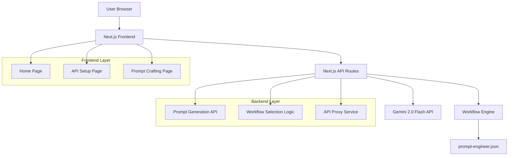

# Design Document

## Overview

The Prompt Engineer Web App is a modern, full-stack application built with Next.js that serves as a prompt optimization tool. The application uses Google Gemini 2.0 Flash as the exclusive LLM for generating prompts that are specifically tailored to different target AI providers. The design emphasizes security, performance, and user experience while maintaining extensibility for future enhancements.

## Architecture

### High-Level Architecture



### Technology Stack

**Frontend:**
- Next.js 14+ with App Router
- React 18+ with TypeScript
- TailwindCSS for styling
- Framer Motion for animations
- React Hook Form for form management
- Zustand for state management

**Backend:**
- Next.js API Routes
- Node.js runtime
- Zod for validation
- Rate limiting middleware

**External Services:**
- Google Gemini 2.0 Flash API

## Components and Interfaces

### Frontend Components

#### Page Components

**HomePage Component**
```typescript
interface HomePageProps {
  onStartCrafting: () => void;
}
```
- Hero section with app explanation
- Call-to-action button
- Responsive design with glassmorphic elements

**APISetupPage Component**
```typescript
interface APISetupPageProps {
  onSetupComplete: (config: APIConfig) => void;
}

interface APIConfig {
  provider: AIProvider;
  model: string;
  apiKey: string;
  reasoning: boolean;
}
```
- Provider selection dropdown
- Model selection based on provider
- API key input with secure handling
- Form validation and error handling

**PromptCraftingPage Component**
```typescript
interface PromptCraftingPageProps {
  config: APIConfig;
  onPromptGenerated: (result: PromptResult) => void;
}

interface PromptResult {
  optimizedPrompt: string;
  targetProvider: string;
  targetModel: string;
  generatedAt: Date;
}
```
- Task description textarea
- Reasoning/Non-reasoning toggle
- Generate button with loading states
- Results display with glassmorphic card

#### Shared Components

**ProviderSelector Component**
```typescript
interface ProviderSelectorProps {
  selectedProvider: AIProvider | null;
  onProviderChange: (provider: AIProvider) => void;
  availableProviders: AIProvider[];
}
```

**ModelSelector Component**
```typescript
interface ModelSelectorProps {
  provider: AIProvider;
  selectedModel: string | null;
  onModelChange: (model: string) => void;
}
```

**PromptResultCard Component**
```typescript
interface PromptResultCardProps {
  result: PromptResult;
  onCopy: () => void;
  onRegenerate: () => void;
}
```

### Backend API Interfaces

#### API Routes

**POST /api/generate-prompt**
```typescript
interface GeneratePromptRequest {
  taskDescription: string;
  targetProvider: AIProvider;
  targetModel: string;
  reasoning: boolean;
  apiKey: string;
}

interface GeneratePromptResponse {
  success: boolean;
  data?: {
    optimizedPrompt: string;
    targetProvider: string;
    targetModel: string;
  };
  error?: string;
}
```

**GET /api/providers**
```typescript
interface ProvidersResponse {
  providers: {
    [key: string]: {
      name: string;
      models: ModelInfo[];
    };
  };
}

interface ModelInfo {
  id: string;
  name: string;
  supportsReasoning: boolean;
}
```

### Data Models

#### Core Types

```typescript
enum AIProvider {
  OPENAI = 'openai',
  ANTHROPIC = 'anthropic',
  GOOGLE = 'google',
  OTHER = 'other'
}

interface WorkflowConfig {
  providers: {
    [key in AIProvider]: {
      promptTemplate: string;
      reasoningTemplate: string;
      models: ModelInfo[];
    };
  };
}

interface SessionState {
  apiKey: string | null;
  selectedProvider: AIProvider | null;
  selectedModel: string | null;
  reasoning: boolean;
}
```

## Error Handling

### Frontend Error Handling

**API Error Handling**
- Network errors with retry mechanism
- Validation errors with inline feedback
- Rate limiting with user-friendly messages
- Session timeout handling

**User Experience Errors**
- Form validation with real-time feedback
- Loading states for all async operations
- Graceful degradation for unsupported features
- Clear error messages with actionable guidance

### Backend Error Handling

**Gemini API Integration**
```typescript
class GeminiAPIError extends Error {
  constructor(
    message: string,
    public statusCode: number,
    public retryable: boolean
  ) {
    super(message);
  }
}
```

**Error Response Format**
```typescript
interface ErrorResponse {
  success: false;
  error: {
    code: string;
    message: string;
    details?: any;
  };
}
```

**Error Categories**
- Authentication errors (invalid API key)
- Rate limiting errors (429 responses)
- Validation errors (malformed requests)
- External service errors (Gemini API failures)
- Internal server errors (unexpected failures)

## Testing Strategy

### Frontend Testing

**Unit Tests**
- Component rendering and props handling
- Form validation logic
- State management functions
- Utility functions

**Integration Tests**
- API integration with mock responses
- User flow testing (setup → crafting → results)
- Error handling scenarios
- Responsive design testing

**Tools**
- Jest for unit testing
- React Testing Library for component testing
- MSW for API mocking
- Playwright for E2E testing

### Backend Testing

**Unit Tests**
- API route handlers
- Workflow selection logic
- Gemini API integration
- Validation schemas

**Integration Tests**
- End-to-end API flows
- External service integration
- Error handling scenarios
- Rate limiting behavior

**Tools**
- Jest for unit testing
- Supertest for API testing
- Mock implementations for external services

### Security Testing

**API Key Security**
- Session-only storage verification
- No persistence in logs or databases
- Secure transmission over HTTPS
- Memory cleanup on session end

**Input Validation**
- XSS prevention
- SQL injection prevention (if database added)
- Rate limiting effectiveness
- CORS configuration

## Workflow Engine Design

### prompt-engineer.json Structure

```json
{
  "version": "1.0",
  "providers": {
    "openai": {
      "name": "OpenAI",
      "promptTemplate": "Create a prompt optimized for OpenAI GPT models...",
      "reasoningTemplate": "Create a reasoning-focused prompt for OpenAI...",
      "models": [
        {
          "id": "gpt-4o",
          "name": "GPT-4o",
          "supportsReasoning": true
        },
        {
          "id": "gpt-4o-mini",
          "name": "GPT-4o Mini",
          "supportsReasoning": true
        }
      ]
    },
    "anthropic": {
      "name": "Anthropic",
      "promptTemplate": "Create a prompt optimized for Claude models...",
      "reasoningTemplate": "Create a reasoning-focused prompt for Claude...",
      "models": [
        {
          "id": "claude-3-sonnet",
          "name": "Claude 3.7 Sonnet",
          "supportsReasoning": true
        }
      ]
    }
  }
}
```

### Workflow Selection Logic

```typescript
class WorkflowEngine {
  private config: WorkflowConfig;

  selectWorkflow(provider: AIProvider, reasoning: boolean): string {
    const providerConfig = this.config.providers[provider];
    return reasoning 
      ? providerConfig.reasoningTemplate 
      : providerConfig.promptTemplate;
  }

  buildGeminiPrompt(
    userTask: string, 
    targetProvider: AIProvider, 
    targetModel: string, 
    reasoning: boolean
  ): string {
    const template = this.selectWorkflow(targetProvider, reasoning);
    return `${template}

Target Model: ${targetModel}
User Task: ${userTask}

Generate an optimized prompt that will work best with the target model.`;
  }
}
```

## Performance Considerations

### Frontend Optimization

**Code Splitting**
- Route-based code splitting with Next.js
- Component lazy loading for heavy components
- Dynamic imports for non-critical features

**Caching Strategy**
- Static assets caching
- API response caching where appropriate
- Browser caching for provider configurations

**Bundle Optimization**
- Tree shaking for unused code
- Image optimization with Next.js Image component
- CSS optimization with TailwindCSS purging

### Backend Optimization

**API Performance**
- Request/response compression
- Rate limiting to prevent abuse
- Connection pooling for external APIs
- Response caching for static data

**Memory Management**
- Automatic cleanup of session data
- Efficient JSON parsing
- Minimal memory footprint for API routes

## Security Architecture

### API Key Management

**Session-Based Storage**
```typescript
interface SecureSession {
  apiKey: string;
  expiresAt: Date;
  userId?: string; // for future user management
}
```

**Security Measures**
- No database persistence of API keys
- Automatic cleanup on session expiration
- Secure HTTP-only session cookies
- HTTPS enforcement in production

### Input Sanitization

**Request Validation**
```typescript
const generatePromptSchema = z.object({
  taskDescription: z.string().min(1).max(5000),
  targetProvider: z.nativeEnum(AIProvider),
  targetModel: z.string().min(1),
  reasoning: z.boolean(),
  apiKey: z.string().min(1)
});
```

**Output Sanitization**
- HTML escaping for user-generated content
- JSON response validation
- Error message sanitization

## Deployment Architecture

### Production Environment

**Vercel Deployment**
- Serverless functions for API routes
- Edge caching for static assets
- Automatic HTTPS and CDN
- Environment variable management

**Environment Configuration**
```typescript
interface EnvironmentConfig {
  NODE_ENV: 'development' | 'production';
  GEMINI_API_ENDPOINT: string;
  RATE_LIMIT_MAX: number;
  SESSION_TIMEOUT: number;
}
```

### Monitoring and Logging

**Application Monitoring**
- Error tracking with structured logging
- Performance monitoring
- API usage analytics
- User experience metrics

**Security Monitoring**
- Failed authentication attempts
- Rate limiting violations
- Suspicious request patterns
- API key usage patterns